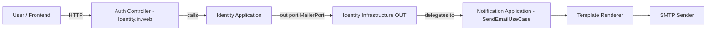
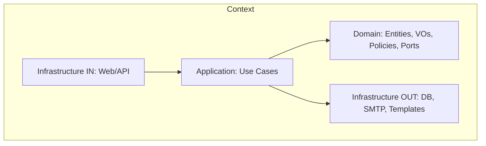

# ClothingStore — Work In Progress (WIP)

> A portfolio e‑commerce backend showcasing **Domain‑Driven Design (DDD)** with **Hexagonal Architecture (Ports & Adapters)**.  
> Current focus: **Identity** (authentication, users) and **Notification** (email templating & delivery).

---

## Table of Contents

- [Project Status](#project-status)
- [Key Features](#key-features)
- [Architecture](#architecture)
    - [Bounded Contexts](#bounded-contexts)
    - [Context Integration](#context-integration)
    - [Layering & Hexagonal Ports](#layering--hexagonal-ports)
    - [Diagrams](#diagrams)
- [Technology Stack](#technology-stack)
- [API Overview](#api-overview)
    - [Identity API](#identity-api)
    - [Notification API](#notification-api)
- [Security Model](#security-model)
- [Persistence & Migrations](#persistence--migrations)
- [Configuration](#configuration)
- [Local Development](#local-development)
- [Testing](#testing)
- [Roadmap](#roadmap)
- [Contributing](#contributing)
- [License](#license)

---

## Project Status

This repository is **actively developed** and intentionally kept as a **learning‑friendly** codebase. The main goal is to demonstrate a production‑style structure and best practices while staying approachable.

- ✅ **Implemented:** Identity & Notification bounded contexts, JWT auth (access + refresh), email verification & password reset, Flyway migrations, OpenAPI/Swagger.
- 🚧 **WIP:** Product, Cart, Orders, Inventory, Payment, and Profile contexts.
- 📌 **Note:** The code is evolving. Names, folders, and endpoints can change as the design matures.

---

## Key Features

### Identity
- User **registration** with **email verification** flow.
- **Login** with short‑lived **access JWT** and **refresh token** in HttpOnly cookie.
- **Token refresh** endpoint (session/rotation support).
- **Logout** invalidating the active refresh session.
- **Forgot/Reset Password** with signed link delivered by email.
- **Change Password** for authenticated users.
- Basic **admin endpoints** to manage users/roles.

### Notification
- **Template‑based emails** rendered with **Thymeleaf** and localized subjects via `MessageSource`.
- SMTP delivery via Spring’s **JavaMailSender**.
- Ready‑to‑use templates: **verify‑email**, **password‑reset**, and **order‑confirmation** (for later use).

---

## Architecture

### Bounded Contexts

- **Identity** — user lifecycle, credentials, sessions, and security.
- **Notification** — email rendering (templates + i18n) and transport (SMTP).

Contexts are independent at the **domain** level. Integration happens via **ports** in a hexagonal style and is wired in **infrastructure**.

### Context Integration

- **Identity** depends on an outbound **port** (e.g., `MailerPort`) to send emails without knowing the delivery details.
- An **infrastructure adapter** provides the concrete implementation and delegates to **Notification**’s email sending use case.
- This keeps Identity’s **domain & application** layers pure and swappable (HTTP client, message bus, or direct in‑process call in the future).

### Layering & Hexagonal Ports

- **Domain**: entities, value objects, domain services, **ports** (`port.in`, `port.out`). No Spring here.
- **Application**: use cases, orchestrating domain behavior. Depends only on **ports**.
- **Infrastructure**: web controllers, persistence adapters (JPA), email adapters (SMTP/Thymeleaf), security, configuration. Wires interfaces to implementations.

### Diagrams

#### High‑level BC interaction


#### Hexagonal layering (per context)



---

## Technology Stack

- **Language:** Java 21
- **Framework:** Spring Boot 3.x, Spring Web, Spring Validation
- **Security:** Spring Security 6, **JWT** (auth0 Java JWT)
- **Data:** Spring Data JPA (Hibernate)
- **Migrations:** **Flyway**
- **Database:** PostgreSQL 16.x
- **Email:** Thymeleaf (templates + i18n), JavaMailSender (SMTP)
- **API Docs:** springdoc‑openapi (Swagger UI)
- **Build/Dev:** Maven, Docker, Docker Compose
- **Utilities:** Lombok (boilerplate), MapStruct (if/when needed), SLF4J/Logback

---

## API Overview

> **Base path** examples below are indicative; check the generated Swagger UI for the authoritative contract.

### Identity API

| Method | Path | Description | Auth |
|---|---|---|---|
| `POST` | `/auth/register` | Register a new user and send a verification email | Public |
| `GET` | `/auth/verify` | Verify email using a token/link | Public |
| `POST` | `/auth/login` | Issue access JWT and set refresh token cookie | Public |
| `POST` | `/auth/refresh` | Refresh the access token using the HttpOnly cookie | Public (cookie) |
| `POST` | `/auth/logout` | Invalidate refresh session and clear cookie | Auth |
| `POST` | `/auth/password/forgot` | Send password reset link by email | Public |
| `POST` | `/auth/password/reset` | Reset password using provided token | Public |
| `POST` | `/auth/password/change` | Change password (current → new) | Auth |
| `DELETE` | `/admin/users/{id}` | Delete user | Admin |
| `PUT` | `/admin/users/{id}/roles` | Assign/replace roles | Admin |

### Notification API

| Method | Path | Description | Auth |
|---|---|---|---|
| `POST` | `/email` | Send an email using a template and model | Protect as needed |

> The Identity ➝ Notification link is implemented via **ports/adapters** (infrastructure wiring), so Identity does **not** depend on Notification’s transport details.

---

## Security Model

- **Access Token (JWT)**: short‑lived; carried in `Authorization: Bearer <token>`.
- **Refresh Token**: long‑lived; stored as **HttpOnly** cookie (optionally `Secure` + `SameSite`).
- **Filters/Config**: Spring Security config opens `/auth/**` and docs; guards others (e.g., `/admin/**`).

---

## Persistence & Migrations

Using **Flyway** to version the schema. Typical objects include:
- `users`, `user_roles`
- `refresh_sessions` (for refresh token rotation/TTL)
- `password_reset_tokens` (hashed tokens, TTL, one‑time use)

A seed migration can create an **admin** account using placeholders for email/hash. Check your `application-*.yml` for the configured values.

---

## Configuration

Key properties (names may vary slightly depending on profile):

```yaml
# JWT
app.security.jwt:
  issuer: AUTH0JWT-BACKEND
  accessTtlSec: 1800        # example
  refreshTtlSec: 1209600    # example (14 days)
  verifyTtlSec: 3600        # example (email verification)

# Identity links
app.verify.baseUrl: https://your-frontend.example/verify-email
app.reset.baseUrl:  https://your-frontend.example/reset-password

# Mail
spring.mail:
  host: localhost
  port: 1025
  username: ""
  password: ""
  properties.mail.smtp.auth: false
  properties.mail.smtp.starttls.enable: false

app.mail:
  defaultFrom: no-reply@clothingstore.local
  templatePrefix: templates/email/
  templateSuffix: .html
  templateCache: true

# Swagger (if needed)
springdoc.swagger-ui.with-credentials: true
```

> Adjust per environment. For local dev, MailHog or similar is recommended.

---

## Local Development

### Prerequisites
- JDK **21**
- Maven **3.9+**
- Docker + Docker Compose
- PostgreSQL (or run via Compose)

### Quick Start

```bash
# 1) Start infra (db, mail)
docker compose up -d

# 2) Run the app (dev profile)
./mvnw spring-boot:run

# 3) Open API docs
# http://localhost:8080/swagger-ui/index.html
```

**Environment variables / .env**  
Create a `.env` or set OS env vars for secrets and connection strings (DB URL, JWT secrets, SMTP). Profiles (e.g., `application-local.yml`, `application-prod.yml`) can override defaults.

---

## Testing

```bash
./mvnw -q test
```

- Unit tests for domain/application logic (use cases, policies).
- Integration tests for web/security/email flows when applicable.
- Consider Testcontainers for DB‑realistic tests.

---

## Roadmap

- **Domain expansion:** Product, Inventory, Cart, Orders, Payment, Profile.
- **Async messaging:** Outbox pattern and event streaming for cross‑context communication.
- **Observability:** Centralized logging, structured logs, metrics, tracing.
- **Security hardening:** Account lockout policy, advanced password policy, audit logging.
- **Docs:** API reference, ADRs, sequence diagrams, deployment notes.
- **CI/CD:** GitHub Actions, container registry, environment promotion.

---

## Contributing

This is a portfolio/learning project. PRs and suggestions to improve structure, tests, and documentation are welcome. Please keep changes aligned with **DDD + Hexagonal** principles.

---

## License

This project is provided for educational and portfolio purposes. Licensing to be defined.
