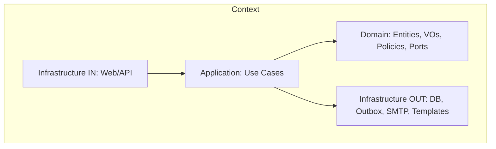
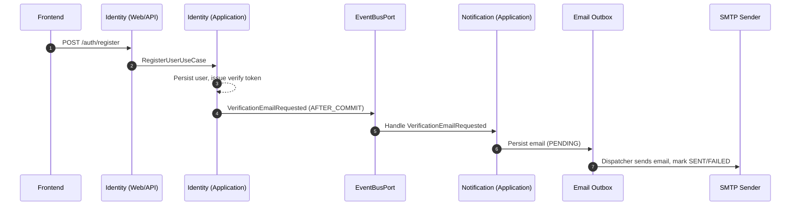
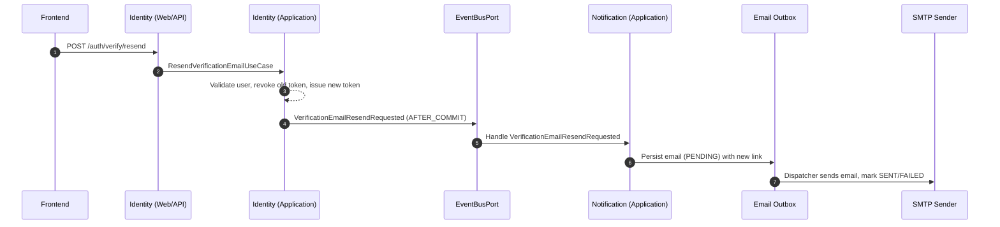

# ClothingStore — Work In Progress (WIP)

> A portfolio e-commerce backend showcasing **Domain-Driven Design (DDD)** with **Hexagonal Architecture (Ports & Adapters)**.  
> Current focus: **Identity** (authentication, users) and **Notification** (email templating, outbox & delivery).

---

## Table of Contents

- [Project Status](#project-status)
- [Key Features](#key-features)
- [Architecture](#architecture)
    - [Bounded Contexts](#bounded-contexts)
    - [Context Integration](#context-integration)
    - [Layering & Hexagonal Ports](#layering--hexagonal-ports)
    - [Diagrams](#diagrams)
- [Events & Integration](#events--integration)
- [Technology Stack](#technology-stack)
- [API Overview](#api-overview)
    - [Identity API](#identity-api)
    - [Notification API](#notification-api)
    - [Error Model](#error-model)
- [Security Model](#security-model)
- [Persistence & Migrations](#persistence--migrations)
- [Configuration](#configuration)
- [Local Development](#local-development)
    - [.env.example](#envexample)
    - [Docker Compose (DB + Mail)](#docker-compose-db--mail)
    - [Quick Start](#quick-start)
    - [Testing the Verification Flow](#testing-the-verification-flow)
- [Testing](#testing)
- [Roadmap](#roadmap)
- [Contributing](#contributing)
- [License](#license)

---

## Project Status

This repository is **actively developed** and intentionally kept as a **learning-friendly** codebase. The main goal is to demonstrate a production-style structure and best practices while staying approachable.

- ✅ **Implemented:** Identity & Notification bounded contexts, JWT auth (access + refresh), email verification & **verification email resend with token rotation & revocation**, password reset, email outbox, Flyway migrations, OpenAPI/Swagger.
- 🚧 **WIP:** Product, Cart, Orders, Inventory, Payment, and Profile contexts.
- 📌 **Note:** The code is evolving. Names, folders, and endpoints can change as the design matures.

---

## Key Features

### Identity

- User **registration** with **email verification** flow.
- **Verification email resend**:
    - Dedicated endpoint to **resend the verification email**.
    - Issues a **new verification token** and **revokes/invalidates** the previous one.
    - Tokens are **one-time-use** and **latest-token-only** (old links stop working after a resend).
    - **Neutral responses** to avoid user enumeration (same response whether the email exists or is already verified).
- **Login** with short-lived **access JWT** and **refresh token** in HttpOnly cookie.
- **Token refresh** endpoint (session/rotation support).
- **Logout** invalidating the active refresh session.
- **Forgot/Reset Password** with signed link delivered by email (also with neutral responses).
- **Change Password** for authenticated users.
- Basic **admin endpoints** to manage users/roles.

### Notification

- **Template-based emails** rendered with **Thymeleaf** and localized subjects via `MessageSource`.
- SMTP delivery via Spring’s **JavaMailSender** (MailHog in dev or external SMTP).
- **Email outbox**:
    - Outbox table to store emails with `PENDING`, `SENT` and `FAILED` statuses.
    - **Dispatcher** service that reads from the outbox and sends emails via SMTP.
    - Supports safe retries and error tracking (e.g. failed sends).
- Ready-to-use templates: **verify-email**, **password-reset**, and **order-confirmation** (for later use).

---

## Architecture

### Bounded Contexts

- **Identity** — user lifecycle, credentials, sessions, and security.
- **Notification** — email rendering (templates + i18n), outbox persistence and transport (SMTP).

Contexts are independent at the **domain** level. Integration happens via **ports** in a hexagonal style and is wired in **infrastructure**.

### Context Integration

- **Identity** depends on outbound **ports** (e.g., `MailerPort` / event publisher ports) to request that verification or reset emails are sent, without knowing the delivery details.
- An **infrastructure adapter** provides the concrete implementation and delegates to **Notification**’s email sending use cases.
- The Notification context persists emails to an **email outbox** and a dispatcher sends them via SMTP.
- This keeps Identity’s **domain & application** layers pure and swappable (HTTP client, message bus, or direct in-process call in the future).

### Layering & Hexagonal Ports

- **Domain**: entities, value objects, domain services, **ports** (`port.in`, `port.out`). No Spring here.
- **Application**: use cases, orchestrating domain behavior. Depends only on **ports**.
- **Infrastructure**: web controllers, persistence adapters (JPA), email adapters (outbox + SMTP/Thymeleaf), security, configuration. Wires interfaces to implementations.

### Diagrams

#### High-level BC interaction

```mermaid
flowchart LR
  U[User / Frontend] -->|HTTP| A[Auth Controller - Identity.in.web]
  A -->|calls| IApp[Identity Application]
  IApp -->|out port MailerPort / EventBusPort| IOut[Identity Infrastructure OUT]
  IOut -->|delegates to| NIn[Notification Application - SendEmailUseCase]
  NIn --> NOutbox[Email Outbox]
  NOutbox --> NSMTP[SMTP Sender (Dispatcher)]
```

#### Hexagonal layering (per context)



---

## Events & Integration

This project uses **domain events** to decouple bounded contexts (e.g. *Identity* → *Notification*), keeping the **domain pure** and enabling future migration to async messaging.

### Current state (in-process)

- **Event bus**: `EventBusPort` with an in-process adapter (Spring-based) to publish/handle events in the same JVM.
- **After-commit delivery**: handlers run **AFTER_COMMIT** to avoid sending emails if the transaction fails.
- **Idempotency**: events carry `eventId` / `occurredAt` for traceability and safe retries.
- **Notification** handlers translate events into **email outbox** records, which are later sent by the dispatcher.

#### Example flow: user registers → verification email



#### Example flow: resend verification email → rotated token & new email



### Roadmap (async)

Move to **Transactional Outbox + Broker** (Kafka/Rabbit) for **cross-context** events (beyond email):

- Outbox table `outbox_event` (eventId, type, payload, occurredAt, processedAt).
- Relay to publish events to broker with retry/DLQ.
- Consumers per BC with **idempotent** handlers (dedupe by `eventId`).
- Observability: propagate `traceId`/`correlationId`.

The **email outbox** in Notification is already implemented; the roadmap focuses on generalizing the pattern across contexts and integrating with a message broker.

---

## Technology Stack

- **Language:** Java 21
- **Framework:** Spring Boot 3.x, Spring Web, Spring Validation
- **Security:** Spring Security 6, **JWT** (Auth0 Java JWT)
- **Data:** Spring Data JPA (Hibernate)
- **Migrations:** **Flyway**
- **Database:** PostgreSQL 16.x
- **Email:** Thymeleaf (templates + i18n), Email Outbox + JavaMailSender (SMTP / MailHog in dev)
- **API Docs:** springdoc-openapi (Swagger UI)
- **Build/Dev:** Maven, Docker, Docker Compose
- **Utilities:** Lombok (boilerplate), SLF4J/Logback

---

## API Overview

> **Base URLs**
>
> - **App**: `http://localhost:8081`
> - **Swagger**: `http://localhost:8081/swagger-ui/index.html`
> - **MailHog UI** (if enabled): `http://localhost:8025`

### Identity API

| Method | Path | Description | Auth |
|-------|------|-------------|------|
| `POST` | `/auth/register` | Register a new user and send a verification email | Public |
| `GET` | `/auth/verify` | Verify email using a token/link | Public |
| `POST` | `/auth/verify/resend` | Resend verification email with rotated token (neutral response, previous token revoked) | Public |
| `POST` | `/auth/login` | Issue access JWT and set refresh token cookie | Public |
| `POST` | `/auth/refresh` | Refresh the access token using the HttpOnly cookie | Public (cookie) |
| `POST` | `/auth/logout` | Invalidate refresh session and clear cookie | Auth |
| `POST` | `/auth/password/forgot` | Send password reset link by email (anti-enumeration response) | Public |
| `POST` | `/auth/password/reset` | Reset password using provided token | Public |
| `POST` | `/auth/password/change` | Change password (current → new) | Auth |
| `DELETE` | `/admin/users/{id}` | Delete user | Admin |
| `PUT` | `/admin/users/{id}/roles` | Assign/replace roles | Admin |

Notes for the verification flows:

- `/auth/verify` validates that the token:
    - Exists and is **not expired**.
    - Is **not revoked** or consumed by previous use.
    - Is the **latest token** issued for that user (older tokens become invalid after a resend).
- `/auth/verify/resend` always returns a **generic/neutral response** (e.g. 202 Accepted + generic message) to avoid leaking whether:
    - The email is registered.
    - The user is already verified.

### Notification API

| Method | Path | Description | Auth |
|-------|------|-------------|------|
| `POST` | `/email` | Send an email using a template and model | Protect as needed |

> Identity → Notification integration is done via **ports/adapters** (infra wiring) and domain events. Identity **does not** depend on Notification’s transport details (outbox/SMTP).

### Error Model

`ErrorResponse` shape (example):

```json
{
  "timestamp": "2025-10-16T23:40:43.748Z",
  "status": 401,
  "error": "Unauthorized",
  "code": "identity.invalid_credentials",
  "message": "Invalid credentials",
  "path": "/auth/login",
  "fieldErrors": [
    { "field": "email", "message": "must be a well-formed email address" }
  ]
}
```

---

## Security Model

- **Access Token (JWT)**: short-lived; carried in `Authorization: Bearer <token>`.
- **Refresh Token**: long-lived; stored as **HttpOnly** cookie (optionally `Secure` + `SameSite`).  
  **Cookie name:** `refresh_token`.
- **Verification Tokens**:
    - Stored as **hashes** in the database (never in plain text).
    - Have a configurable **TTL** (see `verifyTtlSec` / `JWT_VERIFICATION_SECONDS`).
    - Are **one-time** and tied to a specific user.
    - Old tokens are **revoked** when a new one is issued via `/auth/verify/resend`.
- **Security config**: `/auth/**` and docs are open; admin routes (e.g., `/admin/**`) require proper roles.

---

## Persistence & Migrations

Using **Flyway** to version the schema. Typical objects include:

- `users`, `user_roles`
- `refresh_sessions`
    - Refresh token rotation & TTL.
    - Persisted as **hash** with `jti` and expiry.
- `password_reset_tokens`
    - **Hashed**, TTL, **one-time** use.
- `verification_tokens`
    - **Hashed** verification tokens, linked to `users`.
    - Fields typically include: `id`, `user_id`, `token_hash`, `expires_at`, `consumed_at` / `revoked_at`, `created_at`.
    - Enforces **single active token per user** → previous tokens are revoked on resend.
- `email_outbox`
    - Stores outgoing emails for Notification.
    - Fields typically include: `id`, `status` (`PENDING`, `SENT`, `FAILED`), recipient, subject/template ID, payload, `created_at`, `sent_at`, `error_message`, etc.
    - Used by the dispatcher to send emails and update statuses.

**Admin seed placeholders (Flyway):**

- `adminId`, `adminEmail`, `adminPasswordHash` are injected via `spring.flyway.placeholders.*`.

Example mapping in `application.yml`:

```yaml
spring:
  flyway:
    placeholders:
      adminId: ${APP_ADMIN_ID}
      adminEmail: ${APP_ADMIN_EMAIL}
      adminPasswordHash: ${APP_ADMIN_PASSWORD_HASH}
```

---

## Configuration

Key properties (names may vary slightly by profile):

```yaml
# JWT
app.security.jwt:
  issuer: AUTH0JWT-BACKEND
  accessTtlSec: 1800         # example
  refreshTtlSec: 1209600     # example (14 days)
  verifyTtlSec: 3600         # example (email verification tokens, including resends)

# Identity links
app.verify.baseUrl: https://your-frontend.example/verify-email
app.reset.baseUrl:  https://your-frontend.example/reset-password

# Mail (MailHog defaults)
spring.mail:
  host: localhost
  port: 1025
  username: ""
  password: ""
  properties.mail.smtp.auth: false
  properties.mail.smtp.starttls.enable: false

app.mail:
  defaultFrom: no-reply@clothingstore.local
  templatePrefix: templates/email/
  templateSuffix: .html
  templateCache: true

# Swagger
springdoc.swagger-ui.with-credentials: true

# Dotenv import (if used)
spring.config.import: optional:file:.env[.properties]
```

Additional properties (in `application-*.yml`) may configure:

- **Outbox dispatcher**:
    - Execution frequency (cron / fixed delay).
    - Batch size and max retries.
    - Logging/debug options.

Check the concrete configuration files for the exact property names.

---

## Local Development

### .env.example

Add a `.env.example` (do **not** commit real secrets) and document usage:

```bash
# ============ DATABASE ============
DB_NAME=ClothingStore
DB_USER=postgres
DB_PASSWORD=postgres
DB_PORT=5432

# ============ JWT ============
JWT_SECRET=change-me-please
JWT_ISSUER=ClothingStore
JWT_ACCESS_SECONDS=900
JWT_REFRESH_SECONDS=1209600
JWT_VERIFICATION_SECONDS=1800   # controls verification token TTL

# ============ MAIL ============
# A) MailHog local
MAIL_HOST=localhost
MAIL_PORT=1025
MAIL_USERNAME=
MAIL_PASSWORD=
MAIL_SMTP_AUTH=false
MAIL_SMTP_STARTTLS=false
MAIL_DEBUG=true
MAIL_FROM=ClothingStore <no-reply@clothingstore.local>
MAIL_REPLY_TO=no-reply@clothingstore.local

# B) External SMTP (e.g. Gmail App Password)
# MAIL_HOST=smtp.gmail.com
# MAIL_PORT=587
# MAIL_USERNAME=your-email@gmail.com
# MAIL_PASSWORD=your-app-password
# MAIL_SMTP_AUTH=true
# MAIL_SMTP_STARTTLS=true

# ============ LINKS ============
APP_VERIFY_BASE_URL=http://localhost:5173/verify-email
APP_RESET_BASE_URL=http://localhost:5173/reset-password

# ============ COOKIES ============
SECURITY_COOKIES_DOMAIN=

# ============ ADMIN (Flyway seed) ============
APP_ADMIN_ID=00000000-0000-0000-0000-000000000001
APP_ADMIN_EMAIL=admin@example.com
APP_ADMIN_PASSWORD_HASH=$2a$10$.   # bcrypt (cost ~10)

# ============ SPRING ============
SPRING_PROFILES_ACTIVE=dev
```

> Tip: keep a real `.env` locally and ensure `.env` is in `.gitignore`.

### Docker Compose (DB & Mail)

If you use Docker locally, add **PostgreSQL** and (optionally) **MailHog**:

```yaml
# docker-compose.yml (excerpt)
services:
  postgres:
    image: postgres:16
    container_name: clothingstore-postgres
    environment:
      POSTGRES_PASSWORD: ${DB_PASSWORD:-postgres}
      POSTGRES_USER: ${DB_USER:-postgres}
      POSTGRES_DB: ${DB_NAME:-ClothingStore}
    ports:
      - "5432:5432"
    volumes:
      - pgdata:/var/lib/postgresql/data
    restart: unless-stopped

  mailhog:
    image: mailhog/mailhog:latest
    container_name: clothingstore-mailhog
    ports:
      - "1025:1025"   # SMTP
      - "8025:8025"   # Web UI
    restart: unless-stopped

volumes:
  pgdata:
```

### Quick Start

```bash
# 1) Start infra (DB + MailHog)
docker compose up -d postgres mailhog

# 2) Run the app (dev profile)
./mvnw spring-boot:run

# 3) Open API docs
# App:     http://localhost:8081
# Swagger: http://localhost:8081/swagger-ui/index.html
# Mail UI: http://localhost:8025
```

Alternative (external SMTP): start only `postgres` and configure SMTP in `.env`.

### Testing the Verification Flow

Basic manual verification of the email flows in local dev:

1. **Register a user**
    - Call `POST /auth/register` with an email address.
    - Check MailHog (`http://localhost:8025`) and open the verification email.
2. **Verify the account**
    - Click the link from the first email (or copy the token into `GET /auth/verify`).
    - The user should become **verified**; token is marked as **consumed**.
3. **Request a resend (before verifying)**
    - If you register but do **not** verify, call `POST /auth/verify/resend` with the email.
    - A new email should appear in MailHog with a **new token**.
    - The **old link** should no longer work (token revoked).
4. **Check neutral responses**
    - Call `POST /auth/verify/resend` with:
        - A non-existing email.
        - An already verified email.
    - In both cases, the response should be **the same generic message** (no user enumeration).
5. **Inspect the outbox (optional)**
    - Inspect the `email_outbox` table to see how:
        - `PENDING` entries are created when events are handled.
        - The dispatcher updates them to `SENT` or `FAILED`.

---

## Testing

```bash
./mvnw -q test
```

- **Unit** tests for domain/application logic (use cases, policies).
- **Integration** tests for:
    - Web/security flows (login, refresh, logout, admins).
    - Email flows (MailHog/SMTP) including **verification**, **verification resend**, and **password reset**.
- **Outbox / Notification** tests:
    - Creation of outbox entries when events are published.
    - Dispatcher behavior (status transitions `PENDING → SENT` / `FAILED`).
- **Testcontainers** for realistic DB tests (PostgreSQL) if Docker is available.

**Events testing**

- Unit: assert a use case **publishes** the expected event (`EventBusPort` fake).
- Integration: Notification handler **creates outbox records & sends** emails on event reception.

---

## Roadmap

- **Domain expansion:** Product, Inventory, Cart, Orders, Payment, Profile.
- **Async messaging:**
    - Generalize current email outbox into a full **Transactional Outbox** for all cross-context events.
    - Integrate with Kafka/Rabbit (or similar) for external event delivery.
- **Observability:** Centralized logging, structured logs, metrics, tracing.
- **Security hardening:** Account lockout policy, advanced password policy, audit logging.
- **Docs:** API reference, ADRs, sequence diagrams, deployment notes.
- **CI/CD:** GitHub Actions, container registry, environment promotion.

---

## Contributing

This is a portfolio/learning project. PRs and suggestions to improve structure, tests, and documentation are welcome. Please keep changes aligned with **DDD + Hexagonal** principles.

---

## License

This project is provided for educational and portfolio purposes. Licensing to be defined.
